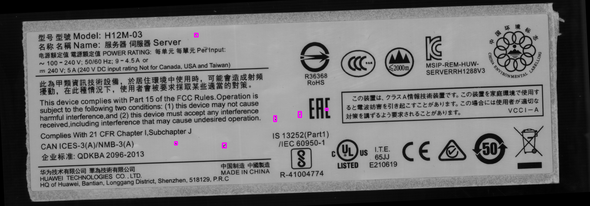
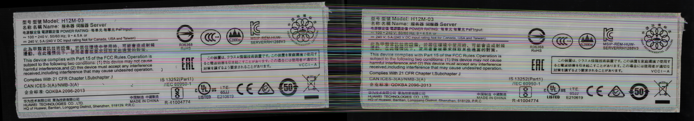
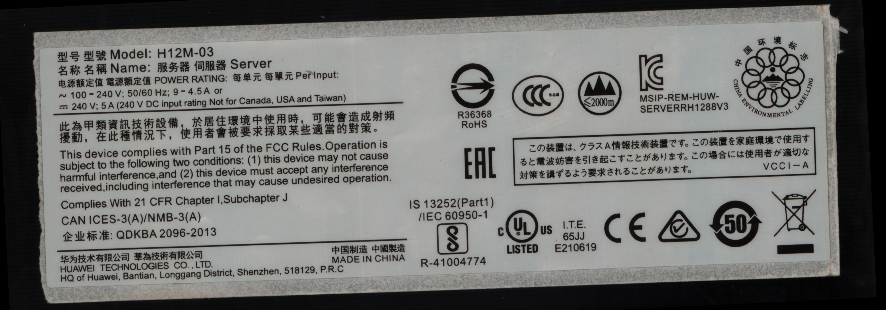
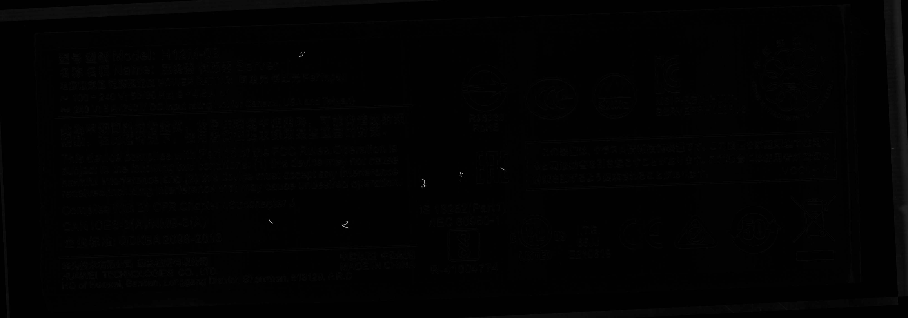

# Print Defect Detection(铭牌印刷缺陷视觉检测系统)

加载过慢可查看README.png
--- 

  

标准图

 

  

待测图

 

  

效果图

 

--- 
## 实现思路及中间处理结果
1. surf获取特征点集；
  

2. 特征点集调优获得标准图到待测图的最优单映射变换矩阵H，然后利用H进行透视变换；
  

3. 变换后的标准图与待测图作差获得图diff；
  

4. 图diff进行阈值化，获得图d_thr;
  

5. 图d_thr进行均值滤波，获的图dt_blur;
  

6. 图dt_blur进行闭运算，获的图dtb_mor；
  

7. 在图dtb_mor进行轮廓的查找，并过滤轮廓周长小于9的轮廓，然后进行画图，获得最后的效果图final；
  
